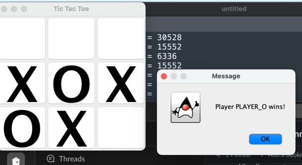

# Intorduction into artificial intelligence HW1 (lecture 2)

Implement Tic Tac Toe game with Minimax algorithm
Algorithm has been modified slightly so that further moves receive less score
to avoid a situation that loss on next turn has better score

## Implementation


For Minimax implementation please refer to [package](./src/main/java/org/vkartashov/minimax)
### How to run
Java is required to be installed on local environment
Run with command for Mac/Linux:
```
./mvnw.sh clean compile exec:java -Dexec.mainClass="org.vkartashov.TicTacToe"
```
Or for Windows:
```
mvnw.cmd clean compile exec:java -Dexec.mainClass="org.vkartashov.TicTacToe"
```